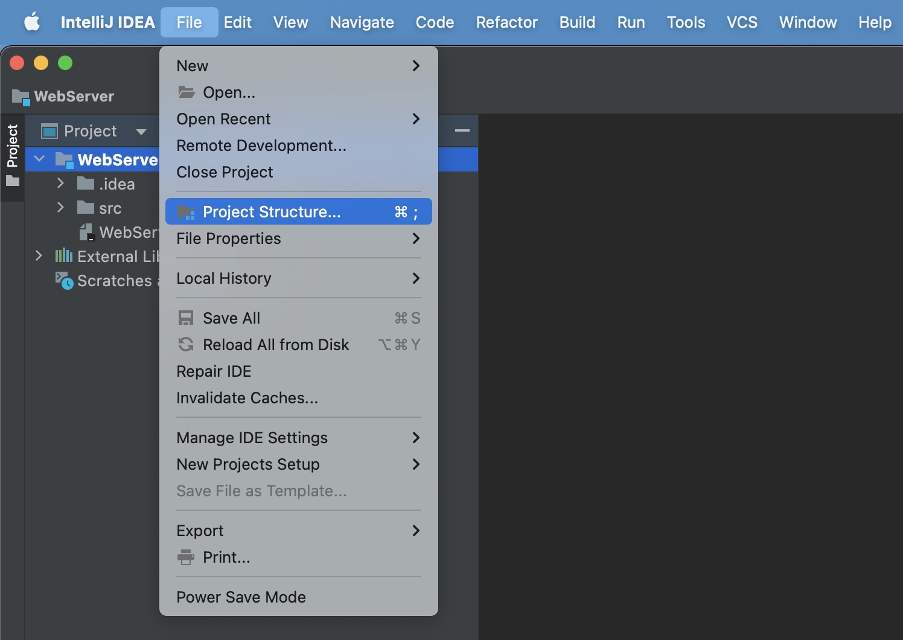
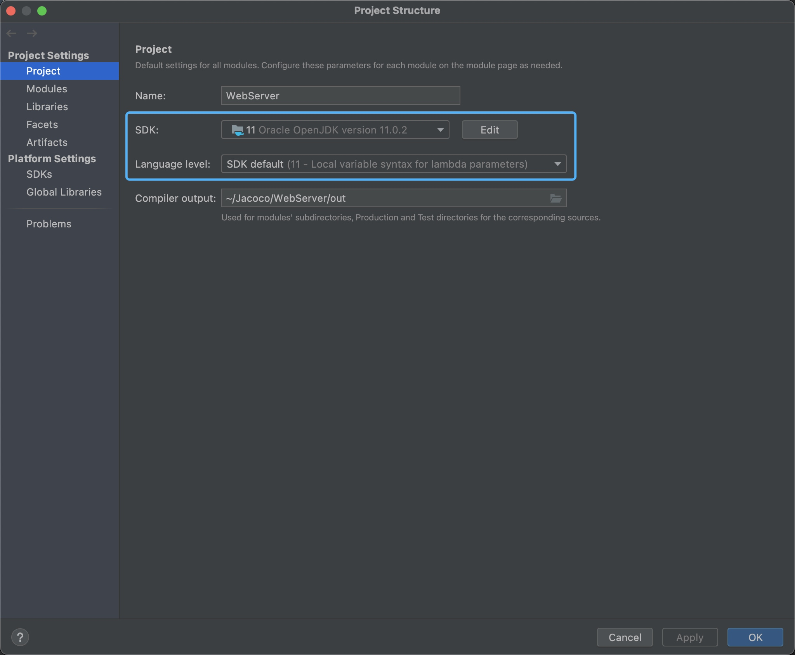
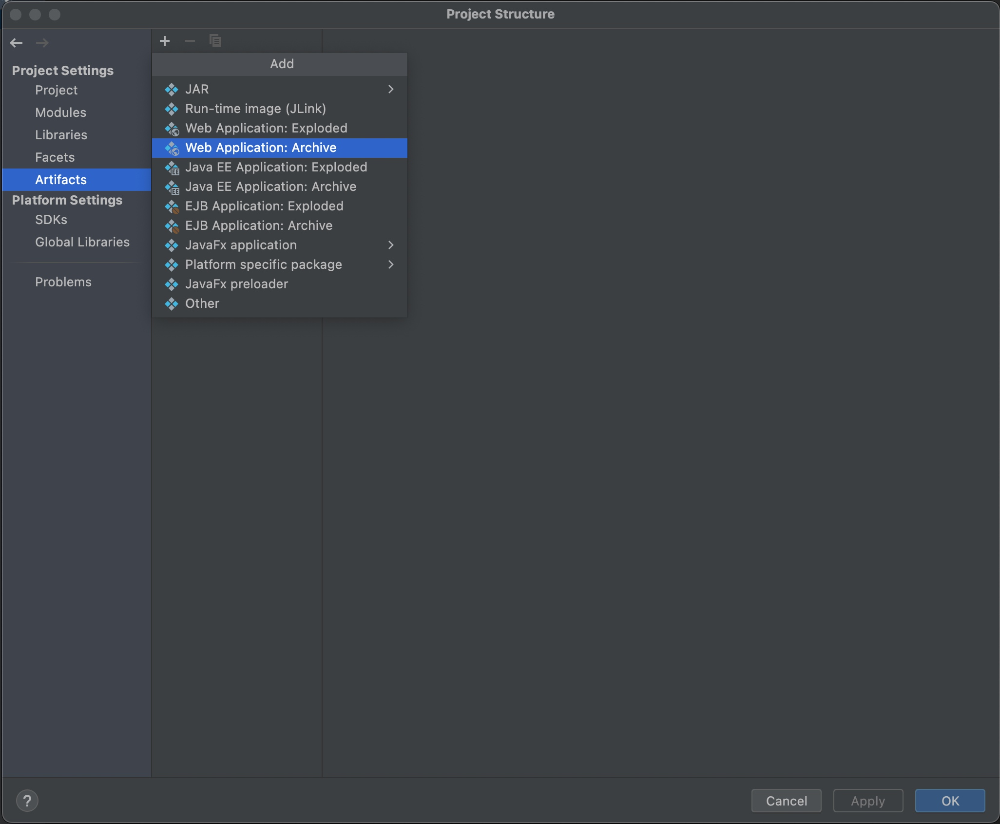
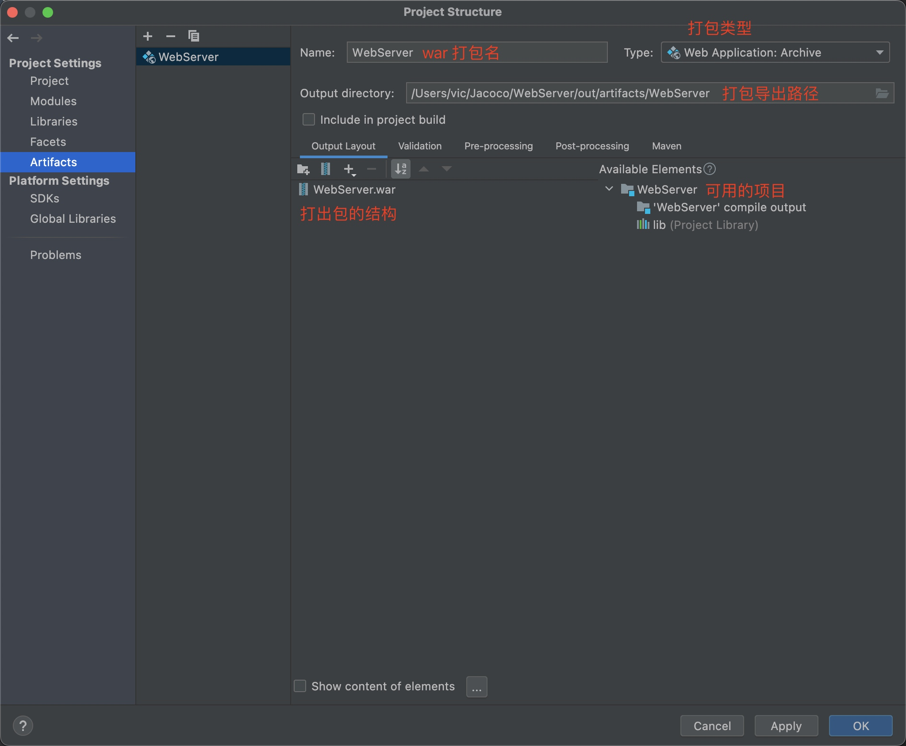
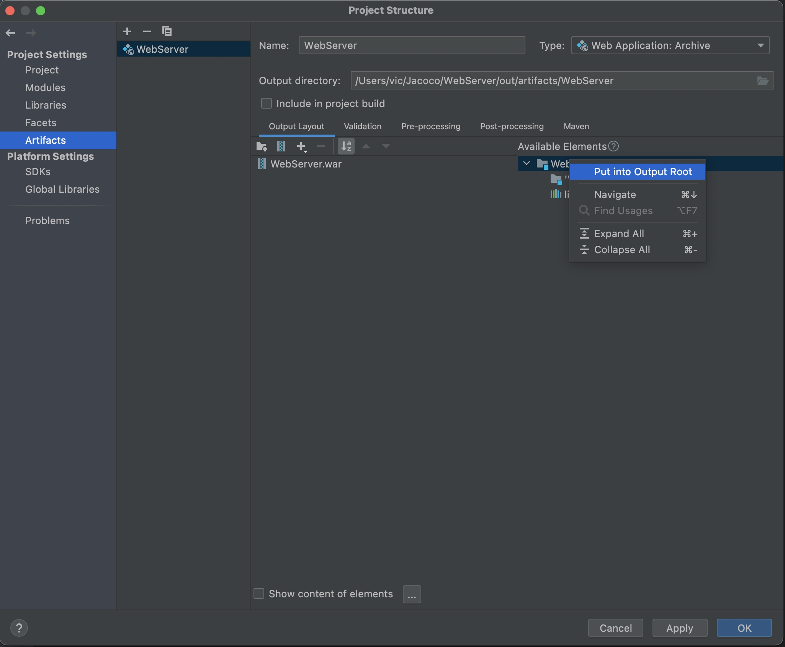
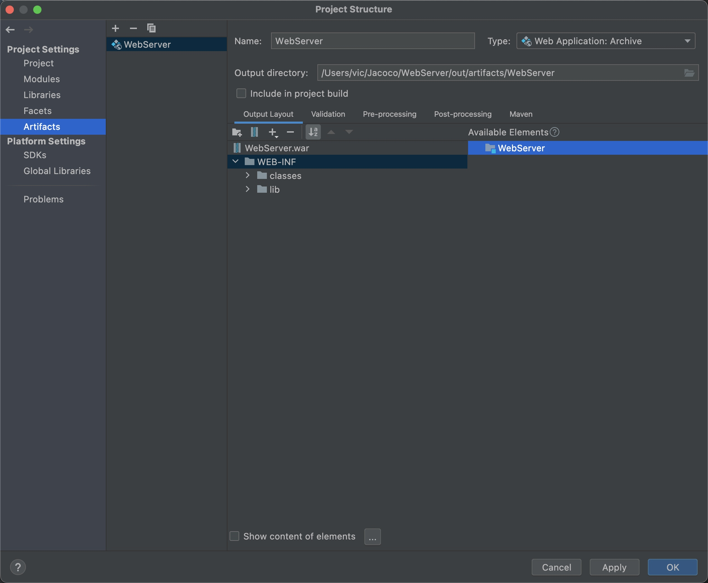
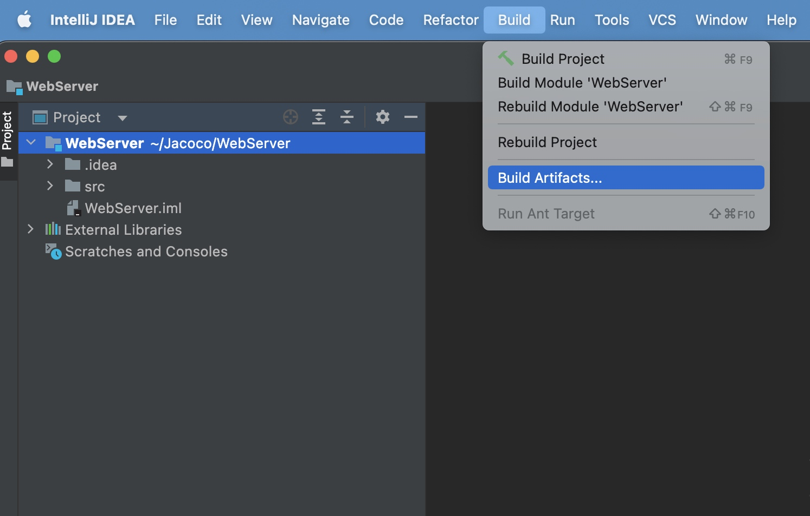
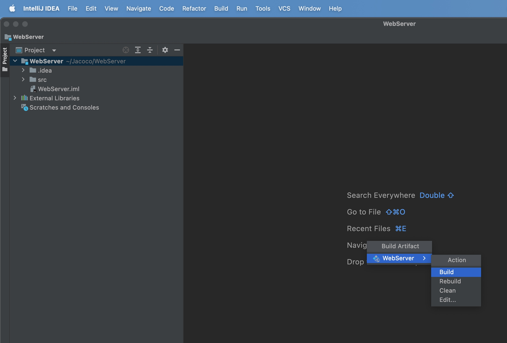

### 前言
JavaWeb 工程，都是打成 war 包后进行发布的，打成 war 包的好处是不会缺少目录，并且只管理好一个发布文件就好。

#### 打开Project Structure
打开IEDA，单击 File——>Project Structure

#### 配置SDK
点击 Project 选择SKD、Language level

#### 增加打包配置(包括项目、打包类型、导出路径等等)
单击 Artifacts——> + ——> Web Application:Archive

#### 修改war包配置
在上一步操作后，会出现如下所示的页面。在该页面中，可以修改war包的包名，修改war包的输出路径等

我们可以右键可用的项目，弹出选项框后选择Put int Output Root。

然后出现左侧信息，选中左侧所标信息，单击Apply——>OK

#### 打包
依次点击 Build——>Build Artifacts

然后选择之前定义的输入war包的名字，选择“build”。在打包路径里面就有XXXX.war，就可以拿到Tomcat下部署了。

