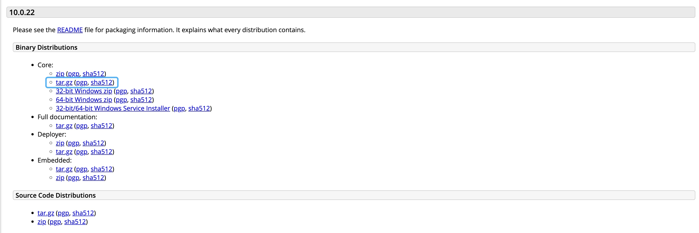
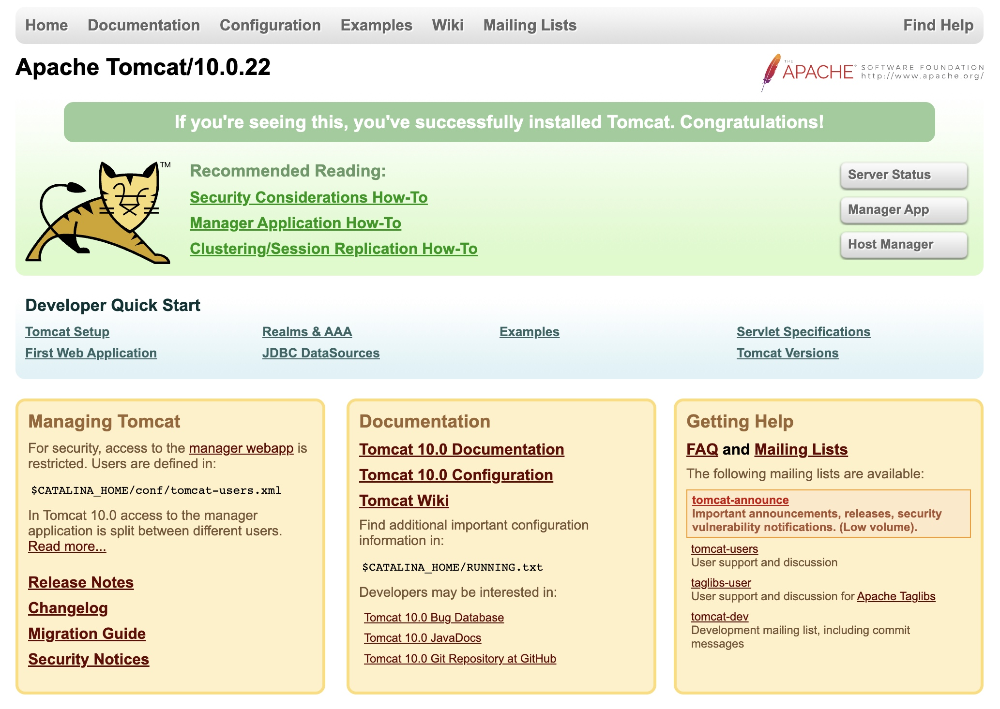

# 将Web项目war包部署到Tomcat服务器
### 前言
Tomcat服务器是一个免费的开放源代码的Web应用服务器，属于轻量级应用服务器，在中小型系统和并发访问用户不是很多的场合下被普遍使用，是开发和调试JSP程序的首选，最新的Servlet和JSP规范总是能在Tomcat中得到体现。

### 下载Tomcat到本地
从官网上下载Tomcat服务器。官网上下载的文件都是绿色免安装的。

下载地址为：[http://tomcat.apache.org](https://tomcat.apache.org/download-10.cgi)



下载后解压缩，如：apache-tomcat-10.0.22

### 部署war
1. 终端启动Tomcat服务器
    进入到`Tomcat`目录下的`bin`目录下
    `cd /Users/vic/Tools/apache-tomcat-9.0.64/bin`
    启动tomcat服务器
    ```
    sh startup.sh
    //需要获得管理员权限的话加上 sudo 
    ```
2. 配置java web 服务器
    将war包放到 `Tomcat`目录下的 `webapps`目录下，Tomcat会自动解压。
    在终端下执行
    `sh shutdown.sh  //关闭服务器`
    然后再输入
    `sh startup.sh  //打开服务器，表示服务器重启（会自动导入这个web）`
    打开浏览器，在浏览器输入“localhost:8080”，回车，如果看到预期的网页，那么表示你的web部署成功。
    
    
### 配置Tomcat
1. server.xml设置
    `/Users/vic/Tools/apache-tomcat-10.0.22/conf/`目录打开`server.xml`
    在Host标签中添加
    `<Context path="" docBase="/Users/vic/Jacoco" debug="0" reloadable="true" />`
    说明： 
    path：为空代表网站根目录
    docBase：可以设置绝对路径，也可设置相对路径，相对路径是相对 appBase 属性所设的目录而言的
2. 配置访问配置路径目录
    若要访问目录，则还需要在web.xml中增加设置
    `/Users/vic/Tools/apache-tomcat-10.0.22/conf/`目录打开`web.xml`
    查找`listings` `false`
    将`false`设成`true`保存
    
配置完后终端执行`sh shutdown.sh`、`sh startup.sh`重启Tomcat。就可以访问本地目录了


